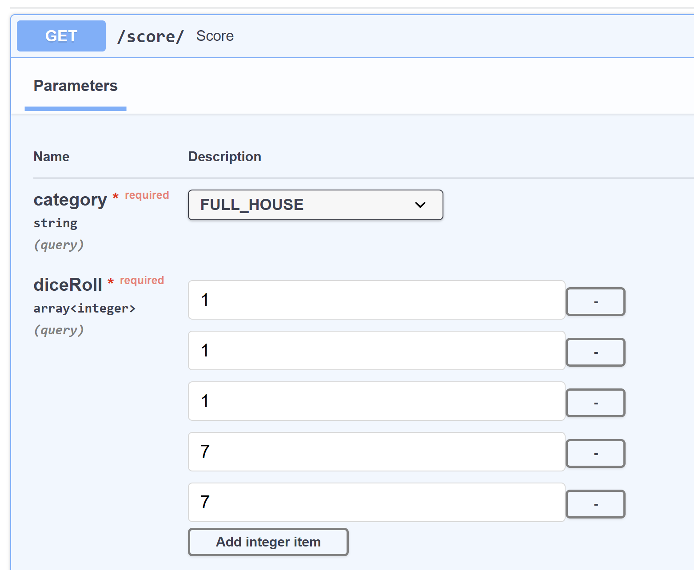
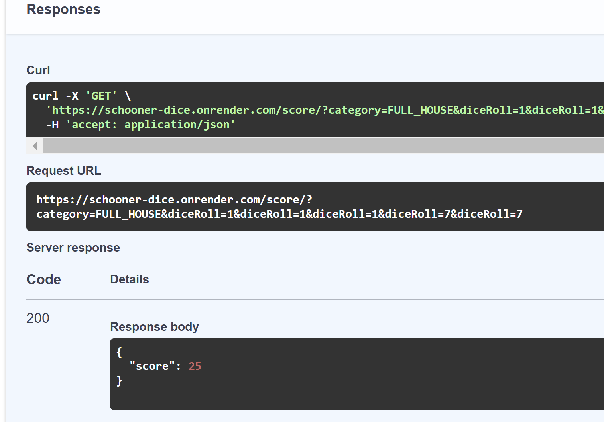
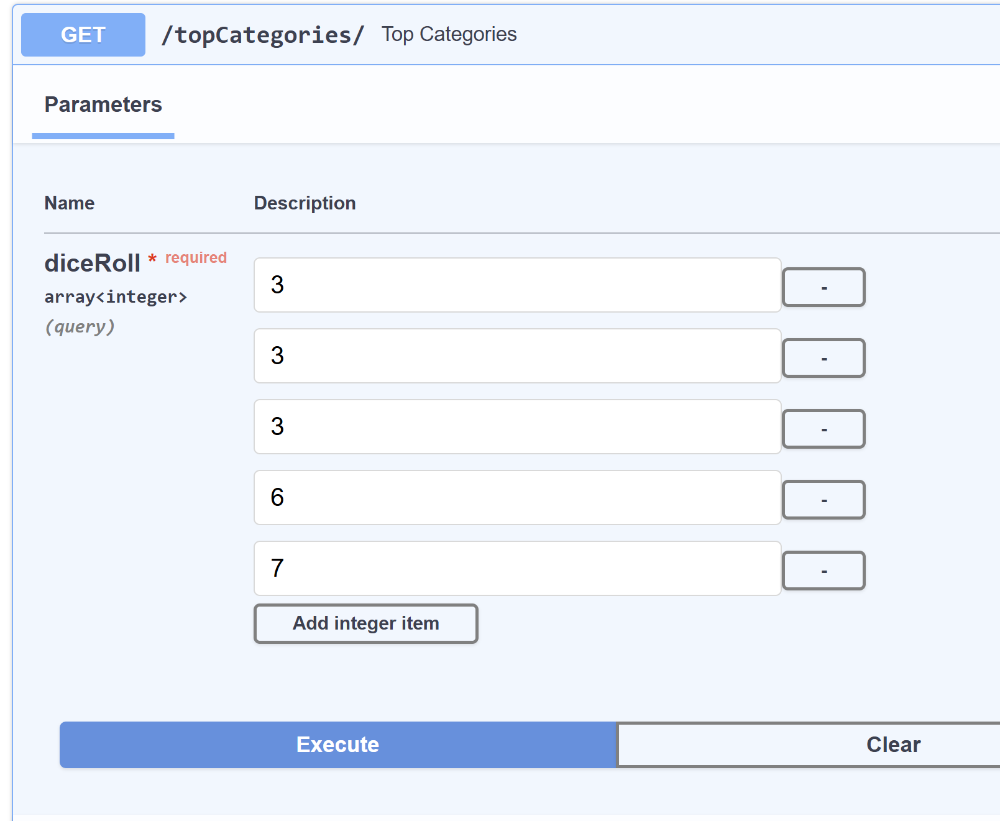
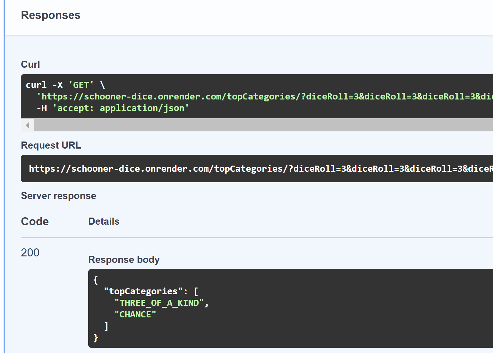

# Seth Anderson's Schooner Dice Submission

## Test Live Online
- View interactive API docs at:
  - **Swagger UI**: [https://schooner-dice.onrender.com/docs](https://schooner-dice.onrender.com/docs)

  
  
  
  

## Requirements

- **Python 3.12+** → [Download Python](https://www.python.org/downloads/)
- **pip (Package Manager)** → Installed with Python
- **Virtual Environment (venv)** → Recommended for dependency management

## Setup Instructions

### Create a Virtual Environment

```bash
python -m venv venv
```

Activate the virtual environment:

- **Windows**:
  ```bash
  venv\Scripts\activate
  ```
- **Mac/Linux**:
  ```bash
  source venv/bin/activate
  ```

### Install Dependencies

```bash
pip install -r requirements.txt
```

### Run the Application in Dev Mode

```bash
fastapi dev main.py
```

- The server will start at [**http://127.0.0.1:8000/**](http://127.0.0.1:8000/)
- View interactive API docs at:
  - **Swagger UI**: [http://127.0.0.1:8000/docs](http://127.0.0.1:8000/docs)

## Running Tests

```bash
pytest
```

## Formatting

```bash
black .
```

---

## Project Structure

```
Schooner Dice
 ┓ services             # Business logic
 ┃ ┗ category.py        # 
 ┃ ┗ schooner.py        # 
 ┃ ┗ scoring.py         # 
 ┓ tests                # Unit tests
 ┃ ┗ test_scoring.py    # 
 ┗ main.py              # FastAPI entry point
 ┗ requirements.txt     # Python dependencies
 ┗ README.md            # Project setup guide
```

---
